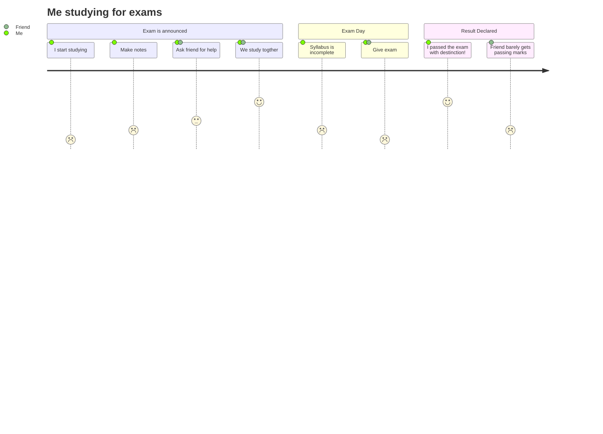

Using `Mermaid` support in markdown files, we can easily create and edit diagrams and flowcharts.

```mermaid
flowchart TD
A --> B;
A --> C;
B --> D;
C --> D;
```
 

```mermaid
journey
	title Me studying for exams
	section Exam is announced
		I start studying: 1: Me
		Make notes: 2: Me
		Ask friend for help: 3: Me, Friend
		We study togther: 5: Me, Friend
	section Exam Day
		Syllabus is incomplete: 2: Me
		Give exam: 1: Me, Friend
	section Result Declared
		I passed the exam with destinction!: 5: Me
		Friend barely gets passing marks: 2: Friend
```
