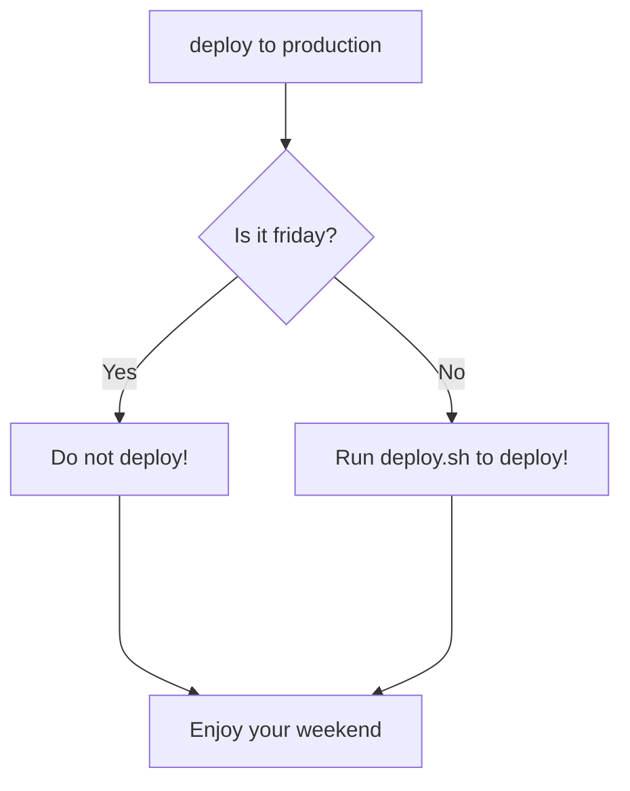

```mermaid
flowchart TD
A[deploy to production] --> B{Is it friday?};
B -- Yes --> C[Do not deploy!];
B -- No --> D[Run deploy.sh to deploy!];
C ----> E[Enjoy your weekend!];
D ----> E[Enjoy your weekend];
```
